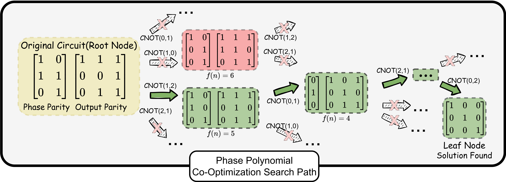

# PhasePoly: An Optimization Framework for Phase Polynomials in Quantum Circuits

PhasePoly is a compilation framework for $\{\text{CNOT}, R_z, X, H\}$ (covering Clifford+T) circuits. It builds a **cross-block phase-polynomial intermediate representation** and runs a **space-bounded A\* search** (Phase Polynomial Co-Optimization) to jointly minimise the **phase-parity** and **output-parity** networks, returning an equivalent circuit with fewer gates. Input and output are OpenQASM 2.0 over $\{\text{CNOT}, R_z, T/T^\dagger, S/S^\dagger, Z, X, H, \text{SWAP}\}$; an equivalence checker powered by Qiskit and MQT-QCEC is bundled for formal verification.



<!-- ## 🔥 News -->

## 🚀 Installation

### Prerequisites

- Python ≥ 3.10

We recommend a dedicated virtual environment:

```shell
python3 -m venv .venv
source .venv/bin/activate
pip install --upgrade pip
pip install -r requirements.txt
```

`requirements.txt` pins the equivalence-checking stack (`qiskit==1.1.1`, `mqt-core==3.2.1`, `mqt.qcec==3.2.0`) plus PhasePoly's deps (`networkx`, `sympy`, `depq`, `numpy`).

Smoke test:

```shell
python -c "from src.phasepoly import phasepoly_synthesize; print('phasepoly ok')"
python -c "from src.circuit_verification import verify_pair;   print('verifier ok')"
```

## 📦 Quickstart

### Python (in-process)

```python
from src.phasepoly import phasepoly_synthesize

result = phasepoly_synthesize(
    circuit_input_path  = "benchmarks/general/barenco_tof_4.qasm",
    circuit_output_path = "/tmp/barenco_tof_4_opt.qasm",
    method              = "row_heap",     # Phase Polynomial Co-Optimization (A*)
    heap_size           = 1000,           # A* priority-queue cap
    ends_checked        = 1000,           # multiple-solution budget k
    group_size          = 3,              # 1 = single-block; >=2 = cross-block IR
    gaussian_elim_algorithm = "modified", # GF(2) Gaussian-elimination backend
    circuit_name        = "barenco_tof_4",
)
print("CX:", result.input_circuit_info["weighted_cx"], "->",
              result.circuit_info["weighted_cx"])
```

### CLI (one shot)

```shell
python -m src.phasepoly \
    benchmarks/general/barenco_tof_4.qasm \
    results/quickstart/barenco_tof_4_opt.qasm \
    --method row_heap --heap-size 1000 --ends-checked 1000 --group-size 3 \
    --circuit-name barenco_tof_4 --quiet
```

Verify the output:

```shell
python -m scripts.verify_circuits single \
    --original benchmarks/general/barenco_tof_4.qasm \
    --compared results/quickstart/barenco_tof_4_opt.qasm \
    --methods qcec --timeout 120
```

Expected result: `qcec: ok EquivalenceCriterion.equivalent`. `python -m src.phasepoly --help` lists every synthesis flag.

## ⚙️ Methods and knobs

`phasepoly_synthesize` exposes six axes. Defaults in **bold**.

| Parameter | Values | What it does |
|---|---|---|
| `method` | **`row_heap`**, `row_heap_classical_GE`, `single_block_greedy`, `single_block_greedy_classical_GE`, `pure_rotation_merging`, `rotation_merging` | Synthesis strategy. `row_heap*` = Phase Polynomial Co-Optimization (A\*); `single_block_greedy*` = Single-block Greedy Optimization baseline; `*rotation_merging` = SSA-style Rotation Merging only (no CNOT synthesis). |
| `rotation_merging_mode` | **`advanced_rotation_merging`**, `pure_rotation_merging` | The SSA-style rotation-merging pass run before *and* after synthesis. The advanced variant additionally rewrites $\text{CNOT}\cdot H$ pairs and propagates $X$ gates through CNOT during preprocessing. |
| `group_size` | **`1`**, `≥2` | `1` = each phase-polynomial block synthesised independently; `≥ 2` = cross-block IR merges that many adjacent blocks across $H$ barriers (requires a `row_heap*` method). |
| `heap_size` | int (default **`10000`**) | A\* priority-queue cap. Larger ⇒ more exploration, slower. |
| `ends_checked` | int (default **`10000`**) | Multiple-solution budget $k$ — how many goal states to collect before returning the best. |
| `gaussian_elim_algorithm` | **`modified`**, `classic` | GF(2) Gaussian-elimination backend. `modified` uses a one-column lookahead pivot. |

Full reference: [docs/methods_summary.md](docs/methods_summary.md).

## 🧪 Benchmarks

```text
benchmarks/general/                              # smaller circuits (adder_8, barenco_tof_4, ham15-med, …)
benchmarks/larger_circuits/{adder, hwb, mcx}/    # larger arithmetic / Hamming coding functions / multi-controlled-X
benchmarks/vqa/{hwea, qaoa, uccsd}/              # variational workloads
```

OpenQASM 2.0 inputs covering arithmetic, Toffoli, Hamming coding functions, multi-controlled-X, and VQA workloads. For local runs, drop your own `.qasm` files in a folder and pass it via `--input-dir`.

## 🔁 Batch and Slurm

### Serial batch (one machine)

[`scripts/run_experiment.py`](scripts/run_experiment.py) enumerates a folder, runs an **Incremental Block Merging** schedule (chained rounds with growing `group_size`) on each circuit, and writes everything under `results/<TAG>/`:

```shell
python scripts/run_experiment.py --tag quickstart \
    --circuits barenco_tof_4,tof_3 \
    --timeout 120 \
    --rounds-json '[{"method":"row_heap","heap_size":1000,"ends_checked":1000,"group_size":1}]'

python scripts/run_experiment.py --tag exp_default
```

Inspect `results/quickstart/phasepoly_best_quickstart/summary.csv` for per-circuit metrics and `*(best).qasm` outputs.

### Slurm cluster (one sbatch entry point)

[`scripts/run_phasepoly_pipeline.sh`](scripts/run_phasepoly_pipeline.sh) builds a tasklist, derives timeouts, and submits one `--array=1-N%K`. Same script for small-scale sanity checks and full multi-hour runs:

```shell
bash scripts/run_phasepoly_pipeline.sh \
    --folders general,larger_circuits/adder,larger_circuits/hwb,larger_circuits/mcx \
    --hard-timeout 10000 --tag phasepoly_full
```

Full flag tables: [docs/running_experiments.md](docs/running_experiments.md) and [docs/slurm.md](docs/slurm.md).

## ✅ Verification

Every optimised output should be checked against its input. Two methods are wired up in [`src/circuit_verification.py`](src/circuit_verification.py):

- `qiskit_equivalence_verification` — `Operator.equiv` for circuits with ≤ 8 qubits.
- `mqt_qcec_verification` — `mqt.qcec.verify` formal check, no qubit cap.

```python
from src.circuit_verification import verify_pair

rec = verify_pair(
    "benchmarks/general/barenco_tof_4.qasm",
    "/tmp/barenco_tof_4_opt.qasm",
    methods=["qcec"], timeout=120,
)
print(rec["qcec"]["status"], rec["qcec"]["detail"])
# -> ok EquivalenceCriterion.equivalent
```

The standalone CLI `python scripts/verify_circuits.py` checks a single pair, a folder, or the cached-results examples in one go. API reference: [docs/verification.md](docs/verification.md).

## 📓 Demonstration notebooks

Run notebooks from the repo root after installing `requirements.txt`:

```shell
jupyter notebook circuit_optimization_demo.ipynb
jupyter notebook circuit_verification_demo.ipynb
```

- [`circuit_optimization_demo.ipynb`](circuit_optimization_demo.ipynb) walks through synthesis methods, rotation merging, block grouping, GE backends, and heap/solution budgets. It writes demo outputs under `results/demo_optimization/` and verifies them.
- [`circuit_verification_demo.ipynb`](circuit_verification_demo.ipynb) verifies the paper's circuit `docs/fig*_*.qasm` pairs and cached `cached_results/general/*(best).qasm` outputs against `benchmarks/general/`. The cached-results run also logs to `results/verification/cached_results_general_qcec.log`.

## 📬 Contact

- Eddy Z. Zhang — eddyzhengzhang \[at] gmail.com
- Zihan Chen — zihan.chen.cs \[at] rutgers.edu
- Henry Chen — hc867 \[at] rutgers.edu

<!-- ## 📖 Citation -->
